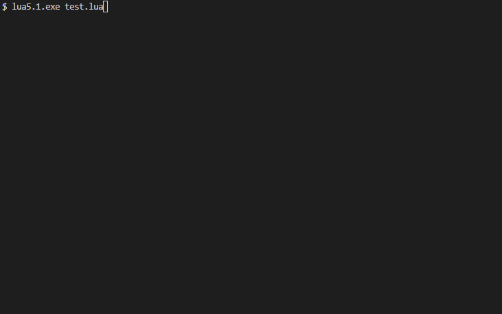

> **Warning**
> Jestronaut is still in early development.

<div align="center">


# Jestronaut 

[](https://github.com/luttje/jestronaut/blob/main/LICENSE)
[](https://luarocks.org/modules/luttje/jestronaut)
[](https://github.com/luttje/jestronaut/actions/workflows/tests.yml)
[](https://libraries.io/github/luttje/jestronaut)
[](https://coveralls.io/github/luttje/jestronaut?branch=main)

</div>

A Lua library for testing your code. It does for Lua what [Jest](https://jestjs.io/) does for JavaScript, with the same API. 

Jestronaut allows you to assert, mock, and spy on your code with ease. It includes a test-runner that you can start from the CLI or Lua:



*For this GIF the tests were run with the verbose and 200ms slowDown settings. Some frames were cut to prevent flickering. The actual duration of these tests was around 0.043s*

## 🚀 Getting Started

> **Note**
> Before continuing, make sure you have installed [LuaRocks](https://luarocks.org/) with at least [Lua 5.1](https://www.lua.org/).

1. Install Jestronaut as a LuaRocks module in your project
    ```bash
    luarocks install jestronaut
    ```

2. Create a test file inside your project, for example:
    ```lua
    -- tests/my_test.lua
    describe("my test", function()
      it("should pass", function()
        expect(1 + 1):toBe(2)
      end)
    end)
    ```

Then you can choose one of two ways to run the tests with Jestronaut:
1. [Run in project with LuaRocks](#run-in-project-with-luarocks)
2. [Download the binary and run tests anywhere](#running-tests-with-lit-binary)

### Run in project with LuaRocks

1. Create a test runner file in the root of your project named `test.lua`:
    ```lua
    require "jestronaut":withGlobals()

    jestronaut
      :configure({
        roots = {
          "./tests/", -- Directory where you saved the test file above
        },
      })
      :registerTests(function()
        package.path = package.path .. ";./tests/?.lua"
        require "my_test"
      end)
      :runTests()
    ```

4. In the root of your project, start your tests using LuaRocks: `luarocks test` or with plain Lua: `lua test.lua`.

### Running tests with lit binary

This binary is a standalone executable that can be used to run Jestronaut tests anywhere. It is built with [lit](https://luvit.io/).

1. Download the latest binary from the [releases page](https://github.com/luttje/jestronaut/releases)

2. Install the binary somewhere in your PATH and rename it to `jestronaut` (or `jestronaut.exe` on Windows)

3. Run the tests with `jestronaut`, for example:

    ```bash
    jestronaut \
      --roots=./tests/generated \
      --roots=./tests \
      --testPathIgnorePatterns=\"/tests/generated/ExpectAPI/toBeCloseTo.lua$/\" \
      --testPathIgnorePatterns=\"/tests/generated/GlobalAPI/test.lua$/\"
    ```

## 🧪 API

Jestronaut tries to match [the API of Jest](https://jestjs.io/docs/api) as closely as possible. Here are some examples of how to use it:

```lua
describe("test organization into suites", function()
  it("should confirm basic math", function()
    expect(1 + 1):toBe(2)      
  end)
end)

it("should let sums NOT match", function()
  expect(1 + 1)['not']:toBe(3)
  expect(1 + 5)['not']:toBeGreaterThan(7)
end)

it("should have all the matchers Jest has", function()
  expect(1 + 1):toBe(2)
  expect(0.1 + 5.2):toBeCloseTo(5.3)
  expect({}):toBeDefined()
  expect(nil):toBeFalsy()
  expect(1 + 1):toBeGreaterThan(1)
  expect(1 + 1):toBeGreaterThanOrEqual(2)
  expect(1 + 1):toBeLessThan(3)
  expect(1 + 1):toBeLessThanOrEqual(2)
  expect(0/0):toBeNaN()
  expect(nil):toBeNil()
  expect(nil):toBeNull()
  expect(1 + 1):toBeTruthy()
  expect(1 + 1):toBeType('number')
  expect(nil):toBeUndefined()
  expect({1, 2, 3}):toContain(2)
  expect({1, 2, 3}):toContainEqual(2)
  expect({1, 2, 3}):toEqual({1, 2, 3})
  expect({1, 2, 3}):toHaveLength(3)
  expect({
    a = 1,
    b = 2,
    c = 3
  }):toHaveProperty('a')
  expect("abc"):toMatch("c$") -- Lua patterns
  expect({
    a = 1,
    b = 2,
    c = 3
  }):toMatchObject({
    a = 1,
    b = 2
  })
  expect({}):toStrictEqual({})
  expect(function() error('test') end):toThrow('test')
  expect(function() error('testing') end):toThrowError('testing')
end)

it('should be able to mock function implementations', function()
  local mockFn = jestronaut:fn(function() return 'x', 'y', 'z' end)
  mockFn(1, 2, 3)

  expect(mockFn):toHaveBeenCalled()
  expect(mockFn):toHaveBeenCalledTimes(1)
  expect(mockFn):toHaveBeenCalledWith(1, 2, 3)
  
  mockFn(3, 2, 1)
  expect(mockFn):toHaveBeenLastCalledWith(3, 2, 1)
  expect(mockFn):toHaveBeenNthCalledWith(1, 1, 2, 3)
  expect(mockFn):toHaveLastReturnedWith('x', 'y', 'z')
  expect(mockFn):toHaveNthReturnedWith(1, 'x', 'y', 'z')
  expect(mockFn):toHaveReturned()
  expect(mockFn):toHaveReturnedTimes(2)
  expect(mockFn):toHaveReturnedWith('x', 'y', 'z')
end)

local ranBefore = 0
beforeAll(function()
  ranBefore = ranBefore + 1
end)

it('should run beforeAll for each "it" this checks how many (so far)', function()
  expect(ranBefore):toEqual(5)
end)

it('can spy on a property setter', function()
  local audio = {
    volume = 0,
  }
  local spy = jestronaut:spyOn(audio, 'volume', 'set')
  audio.volume = 100

  expect(spy):toHaveBeenCalled()
  expect(audio.volume):toBe(100)
end)

it('can spy on a property getter', function()
  local audio = {
    volume = 0,
  }
  local spy = jestronaut:spyOn(audio, 'volume', 'get')
  print(audio.volume)

  expect(spy):toHaveBeenCalled()
  expect(audio.volume):toBe(0)
end)

it:failing('should be able to expected failures', function()
  expect(1 + 1):toEqual(1)
end)

it:skip('should be able to skip tests', function()
  expect(1 + 1):toEqual(1)
end)

it:each({{1, 1, 2}, {1, 2, 3}, {2, 1, 3}})(
  "can loop data (%i, %i = %i)",
  function(a, b, expected)
    expect(a + b):toBe(expected)
  end
)
```

Check out [the Jestronaut tests](https://github.com/luttje/jestronaut/tree/main/tests) for more examples.

## 🦾 Contributing

> **Note**
> Before continuing, make sure you have installed:
> * [NodeJS](https://nodejs.org/en/).
> * [LuaRocks](https://luarocks.org/) with at least [Lua 5.1](https://www.lua.org/).
> * [Luvit](https://luvit.io/)

### Building

To build Jestronaut, run the following command:
```bash
npm run build
```

This builds the [LuaRocks](https://luarocks.org/) module and [lit](https://luvit.io/) binary.

*This will generate a `jestronaut` binary in the `dist` directory of this project. It expects to be added to path and will currently only run tests if you execute jestronaut in the root of your project*

### Jestronaut's own Tests

Most of Jestronaut's own tests are generated from the Jest documentation automatically. 

You can run the test generation script with `npm run generate-tests`. All tests in `tests/generated` will be overwritten.

Use `luarocks test` in the root of this repo to execute the Jestronaut tests.

For coverage install the following LuaRocks modules:
* `luarocks install luacov`
* `luarocks install luacov-reporter-lcov`